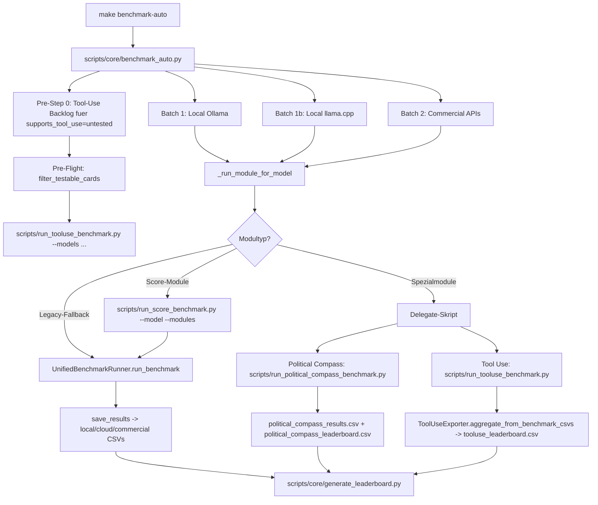

# Benchmark Script Overview

Diese Uebersicht zeigt die Orchestrierung zwischen:
- Standard Benchmark Runner
- den 7 Kernmodulen
- Political Compass
- Tool Use
- Auto Benchmark als Meta-Skript
- CSV/Leaderboard Updates

## 1) Gesamtfluss (Meta-Orchestrierung)



## 2) Standard Benchmark vs. Spezialpfade

```mermaid
flowchart LR
    S[make benchmark] --> RB[scripts/run_score_benchmark.py]
    PC[make political-compass] --> RBPC[scripts/run_political_compass_benchmark.py]
    TU[make benchmark-tooluse] --> RTU[scripts/run_tooluse_benchmark.py]

    RB --> MOD[7 Kernmodule (Score-Module)]
    RBPC --> PCM[political_compass Modul im Batch-Mode]
    RTU --> TUM[run_benchmark.py --module tooluse je Modell]

    MOD --> CSV1[benchmark_scores/local_models_benchmark.csv]
    MOD --> CSV2[benchmark_scores/cloud_models_benchmark.csv]
    MOD --> CSV3[benchmark_scores/commercial_models_benchmark.csv]

    PCM --> PCCSV1[benchmark_scores/political_compass_results.csv]
    PCM --> PCCSV2[benchmark_scores/political_compass_leaderboard.csv]

    TUM --> CSVT[tooluse rows in den Haupt-CSVs]
    RTU --> TULB[benchmark_scores/tooluse_leaderboard.csv]

    CSV1 --> LB[scripts/core/generate_leaderboard.py]
    CSV2 --> LB
    CSV3 --> LB
    PCCSV1 --> LB
    PCCSV2 --> LB
    TULB --> LB
```

## 3) Verantwortlichkeiten pro Skript

| Skript | Rolle | Input | Output |
|---|---|---|---|
| `scripts/core/benchmark_auto.py` | Meta-Orchestrator | aktive Module + Provider + Cache + Card-Status | Startet Batch-Runs, delegiert Score-Module an `run_score_benchmark.py`, delegiert Spezialmodule, aktualisiert Leaderboard |
| `scripts/run_score_benchmark.py` | Score Worker (Module 1-7) | `--model` / `--models` / `--all` + `--modules` | Führt Score-Module aus, schreibt Summary-JSON, nutzt `run_benchmark.py` als Kompatibilitäts-Backend |
| `run_benchmark.py` | Standard Runner | `--module`, `--model`, `--provider`, Config | schreibt Benchmark-Ergebnisse in Haupt-CSVs, triggert Leaderboard |
| `scripts/run_tooluse_benchmark.py` | Tool-Use Runner | Modelle (`--model`/`--models`/`--provider`) + MCP | startet Tool-Use-Laeufe und schreibt `tooluse_leaderboard.csv` via Exporter |
| `scripts/run_political_compass_benchmark.py` | PC Worker | `--model` / `--models` / `--all` + Contract-Flags | Political-Compass Lauf via `run_benchmark.py --module political_compass`, Summary-JSON, PC-CSVs |
| `scripts/core/generate_leaderboard.py` | Leaderboard Builder | alle relevanten CSVs | `benchmark_scores/benchmark_leaderboard.csv` (+ detailed/provider derivates) |

## 4) Wichtige Hinweise fuer den Ablauf

- Zweck von `scripts/core/benchmark_auto.py`: Das Skript ist ein Meta-Orchestrator fuer Auto-Fill-Runs. Es soll fehlende Benchmark-Ergebnisse nachziehen, ohne bereits valide Ergebnisse unnötig neu zu berechnen.
- In `benchmark_auto.py` laeuft Tool Use als Pre-Step fuer untested Cards vor den normalen Batches.
- Score-Module werden in `benchmark_auto.py` explizit an `scripts/run_score_benchmark.py` delegiert.
- Political Compass und Tool Use bleiben als Spezial-Delegate-Module in dedizierten Workern.
- Dadurch bleibt die Ausführungslogik in Fachskripten und das Meta-Skript orchestriert nur.
- CSV-Updates passieren teils im Runner selbst (`save_results`), teils in Spezial-Exportern (Tool Use), und das Leaderboard wird regelmaessig nachgezogen.
- Standardmodus: aktive Skip-Logik (bereits vorhandene/gueltige Ergebnisse werden uebersprungen).
- Force-Modus: `--force` (bzw. `make benchmark-auto FORCE=1`) deaktiviert die Skip-Logik fuer Re-Runs.
- Die Menge der getesteten LLMs wird ausschliesslich ueber `config/provider_config.yaml` gesteuert (aktivierte Provider + modelllisten je Provider). Die Liste kann auch per Ein-/Auskommentieren von Modell-Einträgen angepasst werden.

## 5) Runner Contract (Start Iteration A)

Zur Entkopplung zwischen Orchestrator und Worker wurde ein strukturierter Rueckkanal gestartet:

- Gemeinsamer Helper: `scripts/core/runner_contract.py`
- Optionaler CLI-Parameter bei Workern: `--summary-json <path>`
- Format: `schema = crucible.runner_summary.v1`

Beispiel (vereinfacht):

```json
{
    "schema": "crucible.runner_summary.v1",
    "generated_at": "2026-06-03T12:34:56+00:00",
    "runner": "tooluse",
    "status": "success",
    "mode": "models",
    "models_total": 5,
    "models_successful": 5,
    "models_failed": 0
}
```

Aktueller Stand:

- `scripts/run_tooluse_benchmark.py` schreibt Summary-JSON in Single/Batch-Pfaden.
- `run_benchmark.py` akzeptiert `--summary-json` und schreibt Success/Failed/Aborted-Status.
- `scripts/core/benchmark_auto.py` uebergibt `--summary-json` an Delegate-Worker und liest die Summary fuer Dispatch-Feedback.
